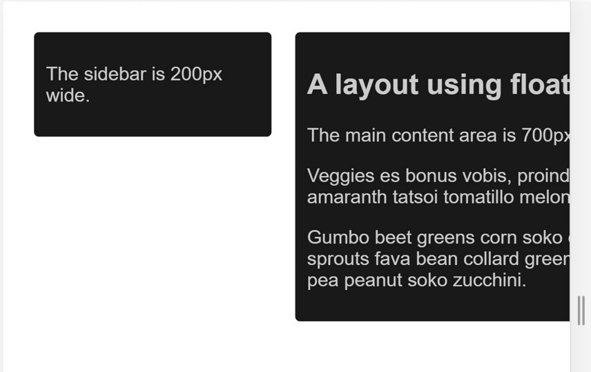
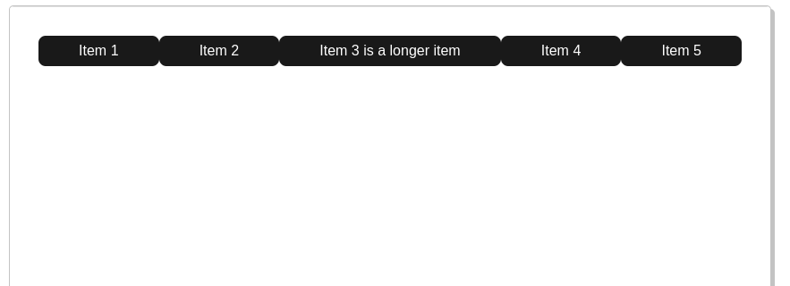

## Adapte el contenido a la ventana gráfica


Tanto en el escritorio como en los dispositivos móviles, los usuarios están acostumbrados a desplazarse por los sitios web verticalmente pero no horizontalmente, obligar al usuario a desplazarse horizontalmente o alejarse para ver toda la página resulta en una mala experiencia de usuario.

Al desarrollar un sitio móvil con una meta etiqueta de ventana gráfica, es fácil crear accidentalmente contenido de página que no encaja del todo dentro de la ventana gráfica especificada. Por ejemplo, una imagen que se muestra con un ancho más grande que la ventana gráfica puede hacer que esta se desplace horizontalmente. Debe ajustar este contenido para que se ajuste al ancho de la ventana gráfica, de modo que el usuario no necesite desplazarse horizontalmente.

La auditoría de Lighthouse del [Contenido no tiene el tamaño adecuado para la ventana gráfica](https://developer.chrome.com/docs/lighthouse/pwa/content-width/?hl=es) puede ayudarle a automatizar el proceso de detección del contenido desbordado.

### Imágenes
```
img {
  max-width: 100%;
  display: block;
}
```

**Agregue las dimensiones de la imagen al elemento img**


Cuando usa `max-width: 100%`, está anulando las dimensiones naturales de la imagen, sin embargo, aún debe usar los atributos de width y height en su etiqueta ``. Esto se debe a que los navegadores modernos usarán esta información para reservar espacio para la imagen antes de que se cargue, esto ayudará a evitar cambios de diseño a medida que se carga el contenido.

### Diseño

Dado que las dimensiones y el ancho de la pantalla en píxeles del CSS varían ampliamente entre dispositivos (por ejemplo, entre teléfonos y tabletas, e incluso entre diferentes teléfonos), el contenido no debe depender de un ancho de ventana en particular para renderizarse bien.

En el pasado, esto requería elementos de configuración que se usaban para crear un diseño basado en porcentajes. En el siguiente ejemplo, puede ver un diseño de dos columnas con elementos flotantes, con un tamaño con base en píxeles. Una vez que la ventana gráfica se vuelva más pequeña que el ancho total de las columnas, tenemos que desplazarnos horizontalmente para ver el contenido.




Al usar porcentajes para los anchos, las columnas siempre quedan como un cierto porcentaje del contenedor. Esto significa que las columnas se vuelven más estrechas, en lugar de crear una barra de desplazamiento.

Las técnicas modernas de diseño de CSS como **Flexbox, Diseño de cuadrículas y Multicol** facilitan mucho la creación de estas cuadrículas flexibles.

### FlexBox

En un diseño responsivo, puede usar Flexbox para mostrar elementos como una sola fila o envueltos en varias filas a medida que disminuye el espacio disponible.

```
.items {
  display: flex;
  justify-content: space-between;
}
```



* [Leer más sobre el diseño de cuadrículas CSS](https://developer.mozilla.org/docs/Learn/CSS/CSS_layout/Grids)
* [Leer más sobre Multicol ](https://developer.mozilla.org/docs/Learn/CSS/CSS_layout/Multiple-column_Layout)